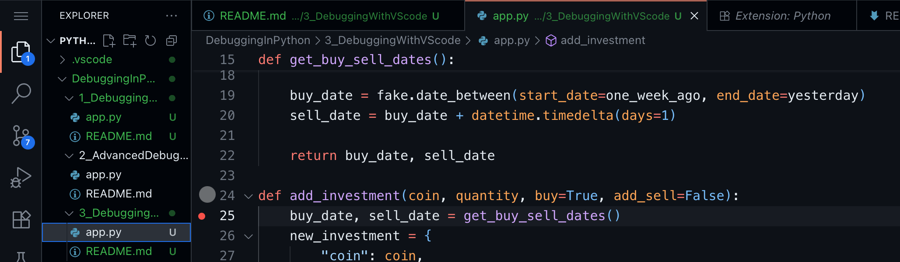
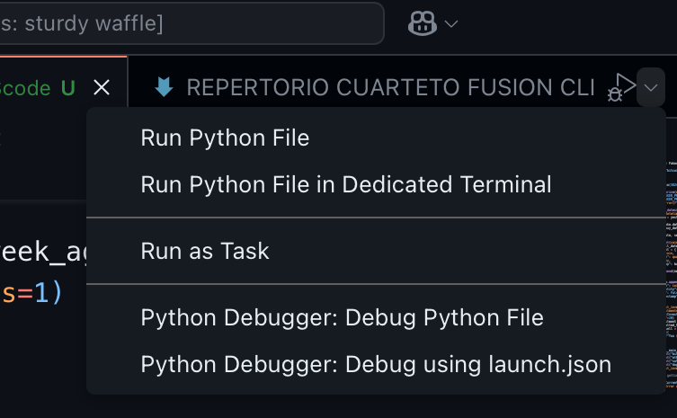
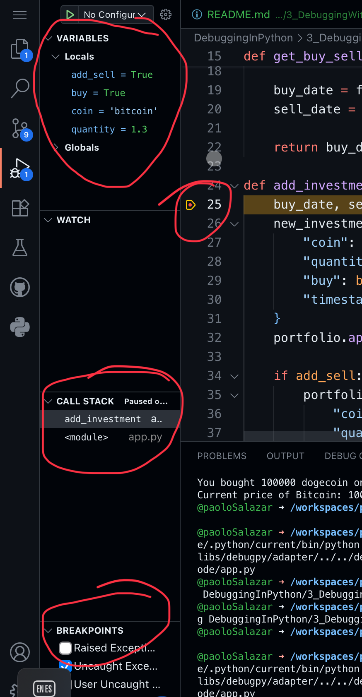
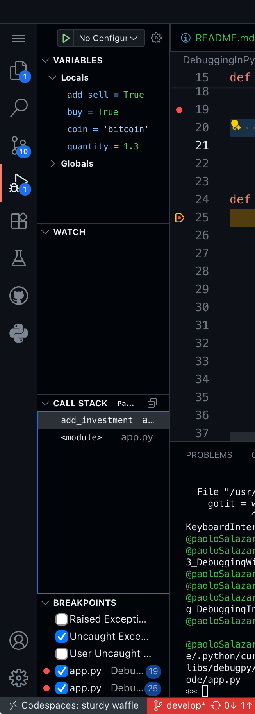
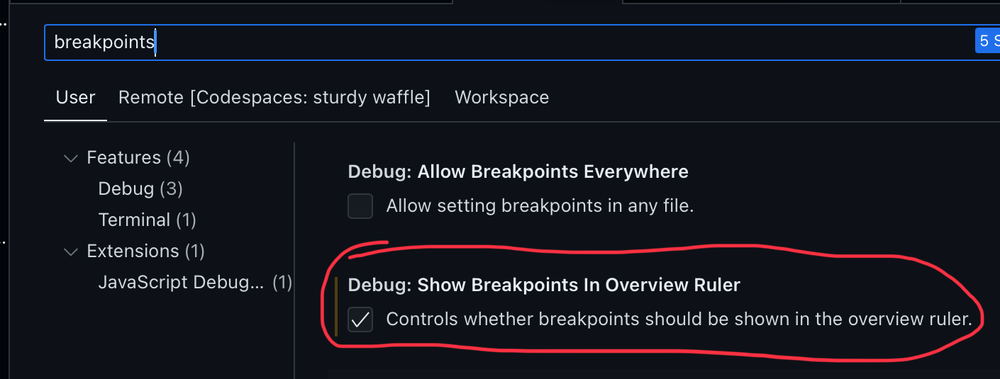
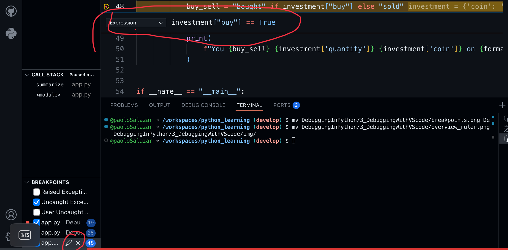

# Debugging Python Code with Visual Studio Code
## Setup VS Code for python debugging
Commands are out, UI is in
* Run and debug from inside of Visual Studio Code
* Manage breakpoints
* Inspect Variables
* Step through code
* Read the call stack
* Evaluate watch expressions
* Use the debug console

## Debugging in Visual Studio Code
* Python extension for Visual Studio Code
* Run and Debug Python code from inside of Visual Studio Code
* No additional code needed to start the debugger
### Commands are so pdb
* Run and debug panel
* Manage breakpoints and inspect variables
* View a lot of information at once that updates in real time
* Debug toolbar

## Demo
install the python extension for VSCode and then add a break point in the code

Then choose debug option

Check the left panel

## Managing Breakpoints in Visual Studio Code
* Enabling, disabling and removing breakpoints
* Conditional breakpoints 
* Debugging exceptions

### Stepping through code
The step over, in and out functions are triggered with buttons in VSCode

### Inspecting Application State
* Continued use of the variables and call stack in the Run and Debug Panel
* Watched expressions
* Debug Console

## Demo
If you add a new breakpoint check the breakpoint left panel

By pressing continue button the stack will skip to the next breakpoint
When we uncheck a breakpoint it is displayed as gray and disabled in the editor section

To Show breakpoints in the overview ruler open user preferences and check this option

For conditional breakpoints edit the break points and add rule
