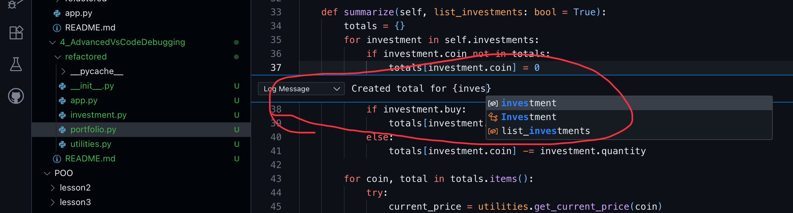
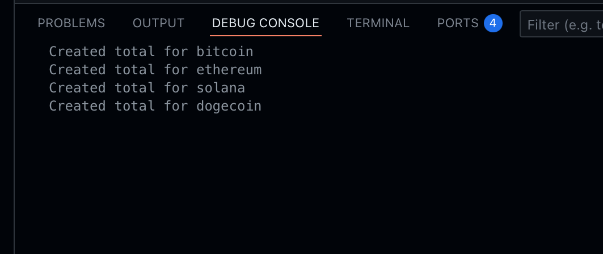
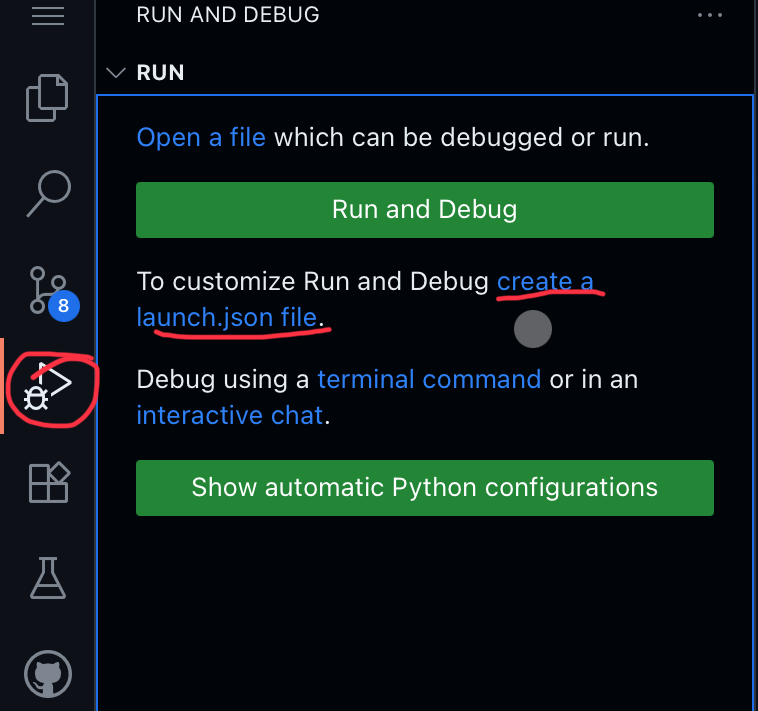
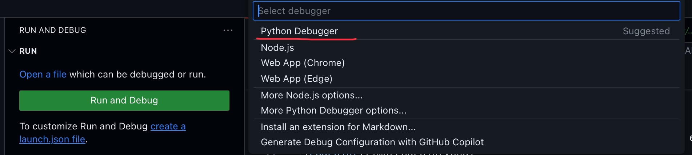
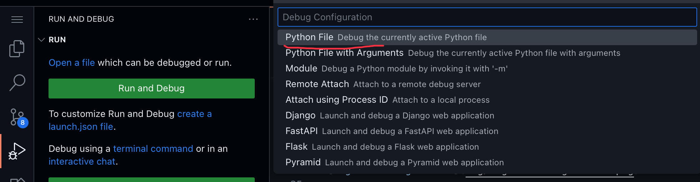
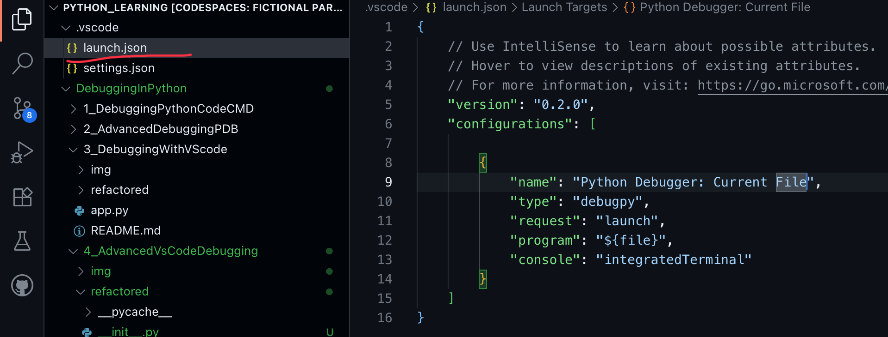

# ADVANCED VISUAL STUDIO CODE DEBUGGING
## Overview
Here come the demos!
Logpoints
Launch Configurations
* Specify the startup file
* Web Applications
Remote Debugging
* Docker containers
* remote servers
Jupyter notebooks
Extension for python utilities

## Logpoints
* A cross between a breakpoint and a watch expression
* Instead of pausing, logpoints log a message to the debug console
* The message can include python expressions
* Great alternative to littering your code with print calls

Right click in left side of editor and select __Add Logpoint__
Then type the message you want to show, also you can use python expressions

The check the __Debug Console__ Section, note the messages were printed


## Launch Configurations
* Saved debug Settings
* Specify the startup file when launching the debugger
* Switch between multiple configurations

Let's add a launch configuration file to debug

go to debug panel and click in the link __Add configuration file__



Then Select python debugger


then select python file


It is going to create a default json file in .vscode at root of project


custom the file with needed configurations
```json
{
    // Use IntelliSense to learn about possible attributes.
    // Hover to view descriptions of existing attributes.
    // For more information, visit: https://go.microsoft.com/fwlink/?linkid=830387
    "version": "0.2.0",
    "configurations": [

        {
            "name": "Python Crypto Debugger",
            "type": "debugpy",
            "request": "launch",
            "program": "DebuggingInPython/4_AdvancedVsCodeDebugging/refactored/app.py",
            "console": "integratedTerminal"
        }
    ]
}
```

Now you are able to debug the python code from anywhere.

## Debugging Web Applications
The python extension includes scaffolded debug configurations for popular web frameworks
